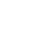
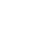
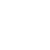
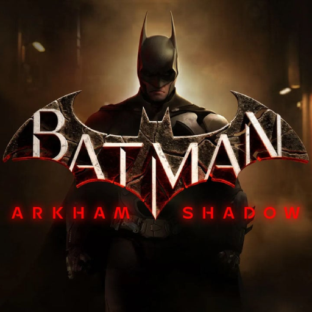
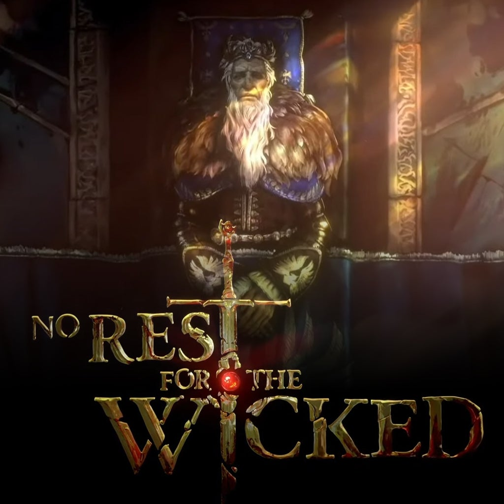
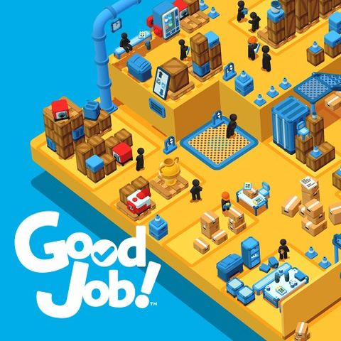

<h1 align="center">Hi 👋, I'm Bruno Mikoski</h1>
<h3 align="center">I have been converting 🍕 into 🕹 for the past 18 years.</h3>

  

Most of my work is related to this

<picture>
  <source media="(prefers-color-scheme: dark)" srcset="icons8-android-os-50.png">
  <source media="(prefers-color-scheme: light)" srcset="icons8-android-os-50-dark.png">
  
</picture>
<picture>
  <source media="(prefers-color-scheme: dark)" srcset="icons8-apple-logo-50.png">
  <source media="(prefers-color-scheme: light)" srcset="icons8-apple-logo-50-dark.png">
  
</picture>
<picture>
  <source media="(prefers-color-scheme: dark)" srcset="icons8-c-sharp-logo-50.png">
  <source media="(prefers-color-scheme: light)" srcset="icons8-c-sharp-logo-50-dark.png">
  
</picture>
<picture>
  <source media="(prefers-color-scheme: dark)" srcset="icons8-jenkins-50.png">
  <source media="(prefers-color-scheme: light)" srcset="icons8-jenkins-50-dark.png">
  
</picture>
<picture>
  <source media="(prefers-color-scheme: dark)" srcset="icons8-github-50.png">
  <source media="(prefers-color-scheme: light)" srcset="icons8-github-50-dark.png">
  
</picture>
<picture>
  <source media="(prefers-color-scheme: dark)" srcset="icons8-unity-50.png">
  <source media="(prefers-color-scheme: light)" srcset="icons8-unity-50-dark.png">
  
</picture>

<picture>
  <source media="(prefers-color-scheme: dark)" srcset="icons8-nintendo-switch-50.png">
  <source media="(prefers-color-scheme: light)" srcset="icons8-nintendo-switch-50-dark.png">
  
</picture>

    <h3><i>Here are some things about me</i></h3>
    <ul>
        <li>🔭 I’m currently working as a Lead Developer at <a href="https://www.bossastudios.com/">Bossa Studios</a></li>
        <li>👨‍💻 I'm originally from Brazil 🇧🇷 living in Portugal 🇵🇹</li>
        <li>🛠️ I develop a bunch of game dev tools in my free time</li>
        <li>🏭 I have co-founded 2 game studios <a href="https://vimeo.com/7823718">99ft Jetpack</a> and <a href="https://www.youtube.com/watch?v=uexu5nklWWw">Monster Juice</a> </li>
        <li>📫 You can shoot me a msg at <b>bruno.mikoski@gmail.com</b></li>
        <li>💎 I really like match 3 games</li>
        <li>💻 Previously at <a href="https://twitter.com/moongamestudios">@MoonGameStudios</a>, <a href="https://lockwoodpublishing.com/">Lockwood Publishing</a>, <a href="https://paladinstudios.com/">@PaladinStudios</a>, and more :D</li>
    </ul>

<h2 align="center">✨ Tools I'm most proud of ✨</h2>

<a href="https://github.com/brunomikoski/ScriptableObjectCollection">
  
</a>
 
 
<a href="https://github.com/brunomikoski/Animation-Sequencer">
  
</a>

 
 
<a href="https://github.com/brunomikoski/SpriteAuditor">
  
</a>

 
 
<a href="https://github.com/brunomikoski/SceneKeeper">
  
</a>

 
 

 
 
<a href="https://github.com/brunomikoski/UIManager">
  
</a>

<h2 align="center">🕹 Latest Projects 🕹</h2>

| Project                                                                    | Title                      | Platforms                                                                                                                                                                                                                                                                                         |
|----------------------------------------------------------------------------|----------------------------|---------------------------------------------------------------------------------------------------------------------------------------------------------------------------------------------------------------------------------------------------------------------------------------------------|
|                  | Batman: Arkham Shadow      |                                                                                                                                        |
|  | No Rest for the Wicked     |                                                                                                                                                     |
|               | Good Job!                  |                                                                                                                              |
| More                                                                       |                            | <a href="https://portfolio.brunomikoski.com/">portfolio.brunomikoski.com</a>                                                                                                                                                                                                                      |

<!--
**brunomikoski/brunomikoski** is a ✨ _special_ ✨ repository because its `README.md` (this file) appears on your GitHub profile.

Here are some ideas to get you started:

- 🔭 I’m currently working on ...
- 🌱 I’m currently learning ...
- 👯 I’m looking to collaborate on ...
- 🤔 I’m looking for help with ...
- 💬 Ask me about ...
- 📫 How to reach me: ...
- 😄 Pronouns: ...
- ⚡ Fun fact: ...
-->
