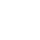

<h1 align="center">Hi 👋, I'm Bruno Mikoski</h1>
<h3 align="center">I have been converting 🍕 into 🕹 in the past 15 years. </h3>

Mostly of my works are related to this

<picture>
  <source media="(prefers-color-scheme: dark)" srcset="icons8-android-os-50.png">
  <source media="(prefers-color-scheme: light)" srcset="icons8-android-os-50-dark.png">
  
</picture>
<picture>
  <source media="(prefers-color-scheme: dark)" srcset="icons8-apple-logo-50.png">
  <source media="(prefers-color-scheme: light)" srcset="icons8-apple-logo-50-dark.png">
  
</picture>
<picture>
  <source media="(prefers-color-scheme: dark)" srcset="icons8-c-sharp-logo-50.png">
  <source media="(prefers-color-scheme: light)" srcset="icons8-c-sharp-logo-50-dark.png">
  
</picture>
<picture>
  <source media="(prefers-color-scheme: dark)" srcset="icons8-jenkins-50.png">
  <source media="(prefers-color-scheme: light)" srcset="icons8-jenkins-50-dark.png">
  
</picture>
<picture>
  <source media="(prefers-color-scheme: dark)" srcset="icons8-github-50.png">
  <source media="(prefers-color-scheme: light)" srcset="icons8-github-50-dark.png">
  
</picture>
<picture>
  <source media="(prefers-color-scheme: dark)" srcset="icons8-unity-50.png">
  <source media="(prefers-color-scheme: light)" srcset="icons8-unity-50-dark.png">
  
</picture>

    <h3><i>Here's some things about me</i></h3>
    <ul>
        <li>🔭 I’m currently working as a Principal Software Engieneer at [Lockwood-Publishing](https://lockwoodpublishing.com/) </li>
        <li>👨‍💻 Some of what I do appears on https://www.tnrd.net</li>
        <li>📫 You can shoot me a msg at <b>hello@tnrd.net</b></li>
    </ul>

### Hi there 👋, I'm Bruno Mikoski

I've been developing games from the past 15 years! From `ActionScript 1` to `C#`  

<!--
**brunomikoski/brunomikoski** is a ✨ _special_ ✨ repository because its `README.md` (this file) appears on your GitHub profile.

Here are some ideas to get you started:

- 🔭 I’m currently working on ...
- 🌱 I’m currently learning ...
- 👯 I’m looking to collaborate on ...
- 🤔 I’m looking for help with ...
- 💬 Ask me about ...
- 📫 How to reach me: ...
- 😄 Pronouns: ...
- ⚡ Fun fact: ...
-->
